# Flow

[](https://pkg.go.dev/github.com/joemocha/flow)
[](https://goreportcard.com/report/github.com/joemocha/flow)
[](https://codecov.io/gh/joemocha/flow)
[](https://github.com/joemocha/flow/actions)
[](http://creativecommons.org/publicdomain/zero/1.0/)

**Modern workflow orchestration library for Go** — An evolutionary Go port of [PocketFlow](https://github.com/The-Pocket/PocketFlow)

Flow provides a single adaptive node that automatically changes behavior based on parameters, eliminating boilerplate while enabling unprecedented composability for building AI agents, complex workflows, and data processing pipelines.

## 🚀 Key Features

- **🎯 Single Adaptive Node**: One node type that automatically adapts behavior based on parameters
- **🔄 Parameter-Driven**: Configure behavior through parameters, not inheritance
- **⚡ Auto-Parallel**: Add `parallel: true` to any batch operation for instant concurrency
- **🔁 Auto-Retry**: Set `retries > 0` to automatically enable retry logic with exponential backoff
- **📦 Auto-Batch**: Set `batch: true` with `data` to automatically process collections
- **🧩 Composable**: Mix retry + batch + parallel in a single node declaration
- **🪶 Ultra-Lightweight**: ~440 lines total vs 748 lines of traditional approaches
- **🧵 Thread-Safe**: SharedState management for safe concurrent data sharing

## Installation

```bash
go get github.com/joemocha/flow
```

## 🎯 The Adaptive Node Approach

### Basic Usage - Pure Simplicity

```go
package main

import (
    "fmt"
    "github.com/joemocha/flow"
)

func main() {
    state := flow.NewSharedState()

    // Single adaptive node - no custom types needed!
    node := flow.NewNode()
    node.SetParams(map[string]interface{}{
        "name": "World",
    })
    node.SetExecFunc(func(prep interface{}) (interface{}, error) {
        name := node.GetParam("name").(string)
        fmt.Printf("Hello, %s!\n", name)
        return "greeted", nil
    })

    result := node.Run(state)
    fmt.Printf("Result: %s\n", result)
}
```

#### Basic Usage Flow Diagram


### Automatic Retry - Zero Boilerplate

```go
func main() {
    state := flow.NewSharedState()

    // Automatic retry when retries > 0 - no custom RetryNode needed!
    node := flow.NewNode()
    node.SetParams(map[string]interface{}{
        "retries":     3,
        "retry_delay": time.Millisecond * 100,
    })
    node.SetExecFunc(func(prep interface{}) (interface{}, error) {
        // Just business logic - retry is automatic!
        if rand.Float32() < 0.7 {
            return "", fmt.Errorf("API temporarily unavailable")
        }
        return "api_success", nil
    })

    result := node.Run(state)
    fmt.Printf("Final result: %s\n", result)
}
```

#### Automatic Retry Flow Diagram


### Automatic Batch Processing

```go
func main() {
    state := flow.NewSharedState()

    // Automatic batch processing when batch: true is set
    node := flow.NewNode()
    node.SetParams(map[string]interface{}{
        "data":  []int{1, 2, 3, 4, 5},
        "batch": true,
    })
    node.SetExecFunc(func(item interface{}) (interface{}, error) {
        // Called once per item automatically!
        num := item.(int)
        return fmt.Sprintf("processed-%d", num*2), nil
    })

    result := node.Run(state)
    fmt.Printf("Batch result: %s\n", result)

    // Results automatically stored in shared state
    results := state.Get("batch_results")
    fmt.Printf("Processed items: %v\n", results)
}
```

#### Automatic Batch Processing Flow Diagram


## 🧩 The Power of Composition

### All Patterns Combined in One Node

```go
func main() {
    state := flow.NewSharedState()

    // Retry + Batch + Parallel in a single node declaration!
    node := flow.NewNode()
    node.SetParams(map[string]interface{}{
        // Batch configuration
        "data": []string{
            "https://api1.example.com",
            "https://api2.example.com",
            "https://api3.example.com",
            "https://api4.example.com",
            "https://api5.example.com",
        },
        "batch": true,
        // Parallel configuration
        "parallel":       true,
        "parallel_limit": 2, // Max 2 concurrent requests
        // Retry configuration
        "retries":     3,
        "retry_delay": time.Millisecond * 200,
    })

    node.SetExecFunc(func(item interface{}) (interface{}, error) {
        // Pure business logic - all patterns applied automatically!
        url := item.(string)
        return fetchURL(url), nil  // With automatic retry + parallel
    })

    result := node.Run(state)

    fmt.Println("Behaviors applied automatically:")
    fmt.Println("✓ Batch processing (5 URLs)")
    fmt.Println("✓ Parallel execution (max 2 concurrent)")
    fmt.Println("✓ Retry logic (up to 3 attempts per URL)")
    fmt.Println("✓ Results collection")
}
```

#### All Patterns Combined Flow Diagram


### Flow Chains with Adaptive Nodes

```go
func main() {
    state := flow.NewSharedState()

    // Create adaptive nodes
    step1 := flow.NewNode()
    step1.SetExecFunc(func(prep interface{}) (interface{}, error) {
        // Processing step
        return "continue", nil
    })

    step2 := flow.NewNode()
    step2.SetParams(map[string]interface{}{
        "data": []int{1, 2, 3, 4, 5},
        "batch": true,
        "parallel": true,
    })
    step2.SetExecFunc(func(item interface{}) (interface{}, error) {
        return item.(int) * item.(int), nil  // Square numbers in parallel
    })

    step3 := flow.NewNode()
    step3.SetExecFunc(func(prep interface{}) (interface{}, error) {
        return "done", nil
    })

    // Chain nodes with specific actions
    step1.Next(step2, "continue")
    step2.Next(step3, "batch_complete")

    // Create and run flow
    flow := flow.NewFlow().Start(step1)
    result := flow.Run(state)

    fmt.Printf("Flow result: %s\n", result)
}
```

#### Flow Chains Flow Diagram

```mermaid
flowchart TD
    A[Start] --> B[Create SharedState]
    B --> C[Create Flow]

    C --> D1[Step1: Adaptive Node]
    D1 --> E1[ExecFunc: Processing]
    E1 --> F1[Return: 'continue']

    F1 --> G{Check Action}
    G -->|continue| D2[Step2: Adaptive Node]

    D2 --> E2["Set Parameters<br/>data: 1,2,3,4,5<br/>batch: true, parallel: true"]
    E2 --> F2["ExecFunc: Square Numbers"]
    F2 --> H2[Parallel Processing]

    H2 --> I21[Goroutine 1: 1² = 1]
    H2 --> I22[Goroutine 2: 2² = 4]
    H2 --> I23[Goroutine 3: 3² = 9]
    H2 --> I24[Goroutine 4: 4² = 16]
    H2 --> I25[Goroutine 5: 5² = 25]

    I21 --> J2[Collect Results]
    I22 --> J2
    I23 --> J2
    I24 --> J2
    I25 --> J2

    J2 --> K2[Return: 'batch_complete']

    K2 --> L{Check Action}
    L -->|batch_complete| D3[Step3: Adaptive Node]

    D3 --> E3[ExecFunc: Final Processing]
    E3 --> F3[Return: 'done']

    F3 --> M[Flow Complete]
    M --> N[End]

    style D1 fill:#e1f5fe
    style D2 fill:#e1f5fe
    style D3 fill:#e1f5fe
    style H2 fill:#e3f2fd
    style M fill:#e8f5e8
```


## 🎯 Parameter Reference

| Parameter | Type | Effect | Example |
|-----------|------|--------|---------|
| `retries` | `int` | Auto-enables retry logic with exponential backoff | `"retries": 3` |
| `retry_delay` | `time.Duration` | Base delay for exponential backoff calculation | `"retry_delay": time.Second` |
| `data` | `[]interface{}` | Data to process (used with batch) | `"data": []int{1,2,3}` |
| `batch` | `bool` | Enables batch processing of data | `"batch": true` |
| `parallel` | `bool` | Enables parallel batch execution | `"parallel": true` |
| `parallel_limit` | `int` | Max concurrent goroutines | `"parallel_limit": 5` |

### Parameter Detection Priority

1. **Batch Processing**: `batch: true` → process each item in `data`
2. **Retry Logic**: `retries > 0` → wrap execution with exponential backoff retry
3. **Single Execution**: Default behavior

**Composability**: Batch + Retry + Parallel can all be combined!

## 🏗️ Core Architecture

### Single Node Type

```go
// One node type handles everything
type Node struct {
    params     map[string]interface{}
    successors map[string]*Node
    execFunc   func(interface{}) (interface{}, error)
    // ... internal adaptive logic
}
```

### SharedState for Data Flow

```go
state := flow.NewSharedState()
state.Set("key", value)
value := state.Get("key")
state.Append("list", item)

// Thread-safe operations
state.GetInt("count")
state.GetSlice("results")
```

## 📊 Performance Comparison

| Approach | Lines of Code | Boilerplate | Composability |
|----------|---------------|-------------|---------------|
| **Traditional OOP** | 85+ lines/pattern | High (inheritance) | Limited |
| **Flow Adaptive** | ~15 lines/pattern | Zero | Unlimited |

### Benchmark Results

```
BenchmarkAdaptiveNodeBasic-48      197M ops   6.2 ns/op    0 allocs
BenchmarkAdaptiveBatchSequential-48 995K ops  1085 ns/op   3 allocs
BenchmarkAdaptiveBatchParallel-48   17K ops   65μs/op      205 allocs
```

## 📚 Complete API Reference

### Core Types

#### `Node`
The adaptive node that changes behavior based on parameters.

```go
type Node struct {
    // Contains filtered or unexported fields
}

// Constructor
func NewNode() *Node

// Configuration
func (n *Node) SetParams(params map[string]interface{})
func (n *Node) GetParam(key string) interface{}

// Workflow chaining
func (n *Node) Next(node *Node, action string) *Node
func (n *Node) GetSuccessors() map[string]*Node

// Execution functions
func (n *Node) SetExecFunc(fn func(interface{}) (interface{}, error))
func (n *Node) SetPrepFunc(fn func(*SharedState) interface{})
func (n *Node) SetPostFunc(fn func(*SharedState, interface{}, interface{}) string)

// Execution
func (n *Node) Run(shared *SharedState) string
```

#### `Flow`
Orchestrates node execution in workflows.

```go
type Flow struct {
    *Node
    // Contains filtered or unexported fields
}

// Constructor and configuration
func NewFlow() *Flow
func (f *Flow) Start(node *Node) *Flow
func (f *Flow) StartNode() *Node

// Execution
func (f *Flow) Run(shared *SharedState) string
```

#### `SharedState`
Thread-safe data sharing between nodes.

```go
type SharedState struct {
    // Contains filtered or unexported fields
}

// Constructor
func NewSharedState() *SharedState

// Basic operations
func (s *SharedState) Set(key string, value interface{})
func (s *SharedState) Get(key string) interface{}

// Typed getters
func (s *SharedState) GetInt(key string) int
func (s *SharedState) GetSlice(key string) []interface{}

// Collection operations
func (s *SharedState) Append(key string, value interface{})
```

### Parameter Reference

| Parameter | Type | Description | Example |
|-----------|------|-------------|---------|
| `batch` | `bool` | Enable batch processing | `"batch": true` |
| `data` | `[]interface{}` | Data for batch processing | `"data": []int{1,2,3}` |
| `parallel` | `bool` | Enable parallel execution | `"parallel": true` |
| `parallel_limit` | `int` | Max concurrent goroutines | `"parallel_limit": 5` |
| `retries` | `int` | Number of retry attempts | `"retries": 3` |
| `retry_delay` | `time.Duration` | Base delay for backoff | `"retry_delay": time.Second` |

### Execution Patterns

#### 1. Single Execution (Default)
```go
node := flow.NewNode()
node.SetExecFunc(func(prep interface{}) (interface{}, error) {
    return "result", nil
})
result := node.Run(state) // Returns: "result"
```

#### 2. Batch Processing
```go
node := flow.NewNode()
node.SetParams(map[string]interface{}{
    "data": []int{1, 2, 3},
    "batch": true,
})
node.SetExecFunc(func(item interface{}) (interface{}, error) {
    return item.(int) * 2, nil
})
result := node.Run(state) // Returns: "batch_complete"
// Results stored in state.Get("batch_results")
```

#### 3. Retry Logic
```go
node := flow.NewNode()
node.SetParams(map[string]interface{}{
    "retries": 3,
    "retry_delay": time.Millisecond * 100,
})
node.SetExecFunc(func(prep interface{}) (interface{}, error) {
    // May fail and retry automatically
    return "success", nil
})
```

#### 4. Parallel + Batch + Retry
```go
node := flow.NewNode()
node.SetParams(map[string]interface{}{
    "data": []string{"url1", "url2", "url3"},
    "batch": true,
    "parallel": true,
    "parallel_limit": 2,
    "retries": 3,
})
// All patterns applied automatically!
```

## 🧪 Comprehensive Test Suite

All adaptive behaviors are thoroughly tested:

```bash
# Run full test suite (11 test functions + 3 benchmarks)
go test ./... -v

# Run with race detection
go test ./... -race

# Performance benchmarks
go test ./... -bench=. -benchmem
```

**Test Coverage:**
- ✅ Basic adaptive behavior
- ✅ Retry pattern detection and execution
- ✅ Batch processing (sequential and parallel)
- ✅ Composed patterns (retry + batch + parallel)
- ✅ Flow integration with adaptive nodes
- ✅ Edge cases and error handling

## 💡 AI Agent Patterns

Perfect for building intelligent agents:

```go
// Intelligent reasoning agent with adaptive patterns
func buildReasoningAgent() *flow.Flow {
    // Input processing with retry
    inputNode := flow.NewNode()
    inputNode.SetParams(map[string]interface{}{
        "retries": 2,
    })
    inputNode.SetExecFunc(parseUserInput)

    // Parallel tool execution
    toolNode := flow.NewNode()
    toolNode.SetParams(map[string]interface{}{
        "data": []string{"search", "calculator", "weather"},
        "batch": true,
        "parallel": true,
        "retries": 3,
    })
    toolNode.SetExecFunc(executeTool)

    // Response generation
    responseNode := flow.NewNode()
    responseNode.SetExecFunc(generateResponse)

    inputNode.Next(toolNode, "needs_tools")
    toolNode.Next(responseNode, "batch_complete")

    return flow.NewFlow().Start(inputNode)
}
```

#### AI Agent Patterns Flow Diagram


## 🔄 Evolution from PocketFlow

| Aspect | PocketFlow | Flow Adaptive |
|--------|------------|-----------------|
| **Core Size** | 100 lines | ~440 lines |
| **Node Types** | 1 BaseNode | 1 Adaptive Node |
| **Patterns** | User-built | Parameter-driven |
| **Composability** | Limited | Unlimited |
| **Boilerplate** | Minimal | Zero |
| **Type Safety** | Runtime | Compile-time |

**Flow captures PocketFlow's constraint-based philosophy while advancing it with parameter-driven composability.**

## 🧪 Testing

```bash
# Run all tests
go test ./flow/...

# Verbose output with test details
go test -v ./flow/...

# Race detection for concurrency safety
go test -race ./flow/...

# Performance benchmarks
go test -bench=. ./flow/...
```

## 🛠️ Development

```bash
# Build the project
go build ./...

# Format code
gofmt -w .

# Run linter
go vet ./...

# Tidy dependencies
go mod tidy

# Generate coverage report
go test -coverprofile=coverage.out ./...
go tool cover -html=coverage.out -o coverage.html

# View coverage in terminal
go test -cover ./...
```

## 🤝 Contributing

1. Fork the repository
2. Create a feature branch (`git checkout -b feature/amazing-feature`)
3. Write tests for your changes (see `flow/node_test.go` for examples)
4. Ensure all tests pass (`go test ./...`)
5. Commit your changes (`git commit -am 'Add amazing feature'`)
6. Push to the branch (`git push origin feature/amazing-feature`)
7. Open a Pull Request

## 📄 License

CC0 1.0 Universal (Public Domain) - see LICENSE file for details.

This work is dedicated to the public domain. You can copy, modify, distribute and perform the work, even for commercial purposes, all without asking permission.

## 🔗 Related Projects

- [PocketFlow](https://github.com/The-Pocket/PocketFlow) - Original Python implementation
- [Flow Examples](./examples/) - Working examples of all adaptive patterns

---

**🚀 Built with modern adaptive patterns for the Go community**
